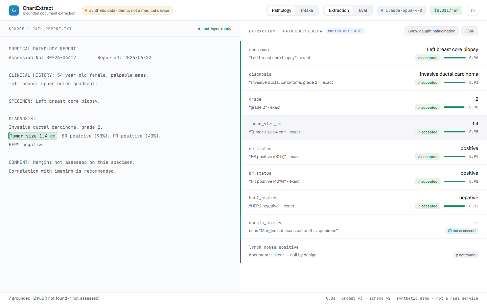
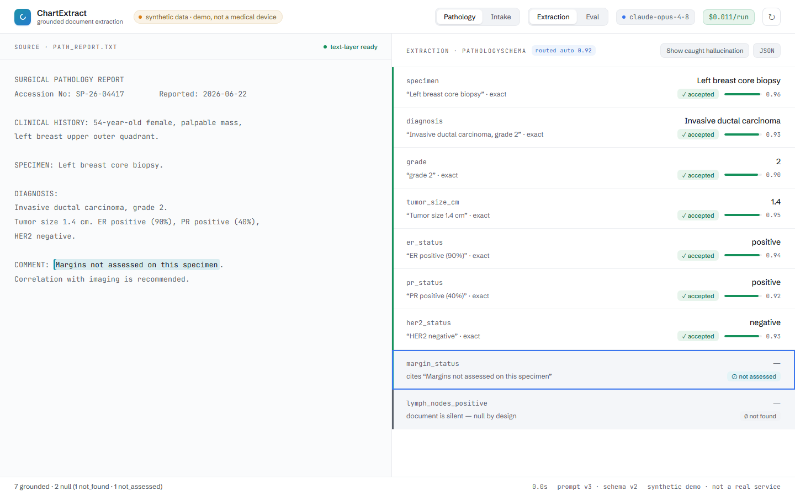
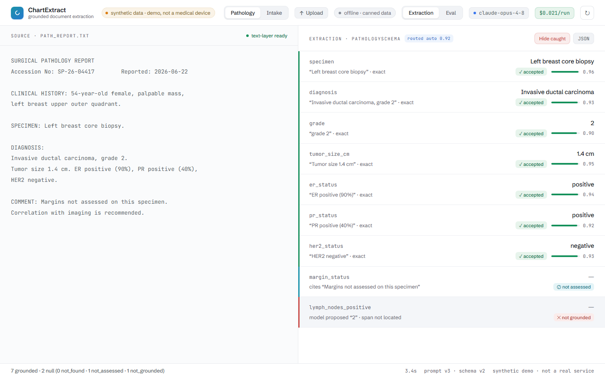
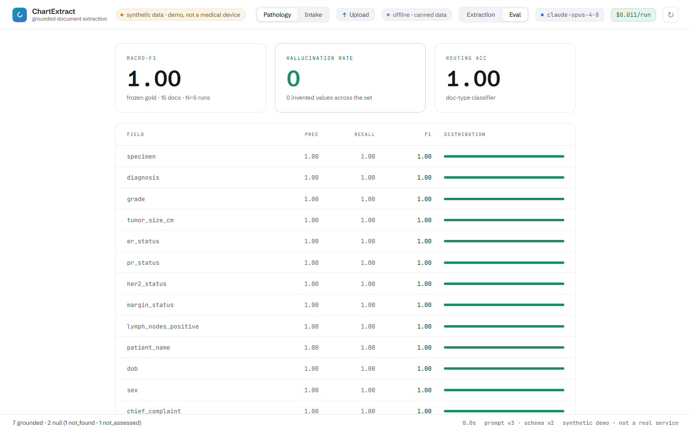

# ChartExtract

**Turn one messy clinical document into strict, schema-validated JSON where every field carries the
verbatim source span it came from, and returns `null`, flagged, for anything it can't ground.**

For anyone moving unstructured clinical text (pathology reports, intake forms) into typed records a
reviewer can trust: the model proposes `{value, source_span, confidence}`, and the **character
offsets, match quality, structural confidence, and flags are all computed in code, never by the
model.** A value the engine can't find verbatim in the source becomes `null` with a flag
(`not_found`, `not_assessed`, `not_grounded`, `needs_review`, `ambiguous_span`), so the demo's
headline, **hallucination-rate 0**, is structural rather than a hope.

ChartExtract extracts structured data *from* a source document. It is not a verifier of generated
answers: the input is a source doc (not a generated answer) and the output is typed records (not a
verdict). The story is always *document to structured schema*.

## Architecture

The model never returns offsets. It returns `{value, source_span, confidence}` only; everything that
makes a value trustworthy is computed deterministically in code (this is load-bearing).

```text
            ┌──────────────────────────── chartextract.extract() ────────────────────────────┐
  document  │   load            route           parse            ground-in-code      assemble │
  (.txt/    │   ───────►        ───────►        ───────►         ──────────────►     ──────►  │  ExtractionResult
   .pdf/    │   canonical       doc-type        provider call    span match +        counts,  │  (fields[] with
   text)    │   text = the      schema          {value,          structural conf +   cost,    │   offsets, flags,
            │   offset source   (override or     source_span,     flag; invented      latency  │   confidence)
            │                   classifier)      confidence}      values are nulled            │
            └─────────────────────────────────────────────────────────────────────────────────┘
```

- **load** turns a PDF text-layer or plain text into one canonical string (the single source of
  character offsets).
- **route** uses a schema override when given, otherwise a doc-type classifier; an unresolved type
  is surfaced, never guessed.
- **parse** asks the provider for `{value, source_span, confidence}` per field (no offsets, ever).
- **ground-in-code** runs a whitespace-tolerant matcher that locates each span, scores match quality
  (`exact=1.0`, `whitespace=0.92`, `prefix=0.5`), derives structural confidence, and assigns the
  flag. A span that doesn't appear in the source becomes `value=null`, flag `not_grounded`.
- **assemble** builds the typed `ExtractionResult`: every field with its offsets, flag, and
  confidence, plus footer counts, priced `$/doc`, and measured latency.

The engine (`core/`) is provider-agnostic; the realized live backend is **Azure OpenAI GPT-5.5**
(`core/src/chartextract/provider/openai.py`), and a deterministic offline **stub** runs the whole
pipeline with no key. The thin HTTP adapter (`api/`) serves the engine and the web UI (`app/`)
same-origin; the eval harness (`eval/`) produces the leaderboard.

## The money demo

One command, no key, under a minute:

```bash
make demo-stub            # or: python demo.py --stub
```

It loads a sample, extracts it through the real pipeline, prints the field table, spotlights the
honest nulls, and runs the offline eval leaderboard. The same story in the browser:

| Hero hover: value to source span | The two honest nulls |
|---|---|
|  |  |

| The not_grounded catch (what the model *said*, rejected) | Eval leaderboard: hallucination-rate 0 |
|---|---|
|  |  |

More frames: [extraction streaming state](docs/screenshots/05-streaming-state.png),
[ListField intake](docs/screenshots/06-listfield-intake.png),
[no-text-layer banner](docs/screenshots/07-no-text-layer-banner.png),
[narrow / stacked](docs/screenshots/08-narrow-stacked.png).

What the stub demo prints (the pathology sample), both nulls distinctly flagged, hallucination-rate 0:

```text
margin_status         ->  null   [not_assessed]
    the document explicitly says it was not assessed - a cited absence
    cited sentence: "Margins not assessed on this specimen"
lymph_nodes_positive  ->  null   [not_found]
    the model found nothing to extract - returned null, not a guess

  HALLUCINATION-RATE  0.00  (0 hallucinated / 22 null-gold fields)  <<< 0 across the frozen set
```

## Quickstart

```bash
make install              # editable: core (+ provider SDKs) + eval + api + dev tooling
make demo-stub            # the offline money demo: no key, no network, $0, deterministic
make test                 # the Tier-1 (no-key) suite
```

Then see it in the browser (the API serves the UI at the same origin, so there's no CORS to
configure):

```bash
make serve                # chartextract-api → http://127.0.0.1:8000/
# or, with one command including the browser:
python demo.py --stub --open
```

Or via Docker (no local Python setup; defaults to the stub, **no secret in the image**):

```bash
make docker-build && make docker-up      # open http://localhost:8000/
```

### Running live (optional, opt-in, costs money)

Copy [`.env.example`](.env.example) to `.env` and set `AZURE_OPENAI_ENDPOINT` plus
`AZURE_OPENAI_API_KEY` (or `OPENAI_API_KEY` for api.openai.com). Then:

```bash
python demo.py --live                     # live extraction + real cost/latency
chartextract extract examples/path_report.txt   # CLI auto-selects live when a key is set
```

With no key, `--live` prints a fallback note and runs the offline stub, never a traceback. The
`@pytest.mark.api` conformance tests need a key and auto-skip without one, so the free Tier-1 suite
always passes.

## Eval

The leaderboard is reproducible offline against a frozen synthetic gold set:

```bash
make eval                 # python -m eval.run --provider stub --no-write
python -m eval.run --provider stub        # also writes docs/eval/leaderboard-<date>.{jsonl,txt}
python -m eval.run --provider openai      # live GPT-5.5 sweep (needs a key, opt-in)
```

It scores per-field precision/recall/F1, macro-F1, **hallucination-rate** (a non-null value where
the gold is null, counted loudly), routing accuracy, and a per-doc cost comparison. Add `--batch` to
a live sweep to run it through the **Batch API** (~50% cheaper; results re-keyed by `custom_id`).

> **Honesty note.** The gold set is small and **synthetic, never real PHI**; report F1 with wide
> intervals (run `--repeats N` to see the spread). **ChartExtract is not a medical device**, it is a
> demonstration. The cost rows are labeled **measured** vs **estimate**: the live model (GPT-5.5,
> ~`$0.005/doc` on the path report) is measured from real usage; the Opus/Sonnet rows are
> computed-from-pricing **estimates** (no Anthropic key in this build) and are never shown as
> measured.

## Layout

```text
core/    the chartextract engine (schemas, load, grounding, confidence, router, pipeline, providers, CLI)
api/     thin FastAPI adapter over core.extract; serves app/ same-origin (+ Dockerfile)
app/     the web UI (wired to the API), Playwright e2e / a11y / responsive suite
eval/    field-level eval harness + frozen gold set + normalizers
examples/ path_report.txt, intake_form.txt   demo.py  Makefile  docker-compose.yml
```

The UI/UX design specification is [`app/ChartExtract-UIUX-Spec.md`](app/ChartExtract-UIUX-Spec.md).
