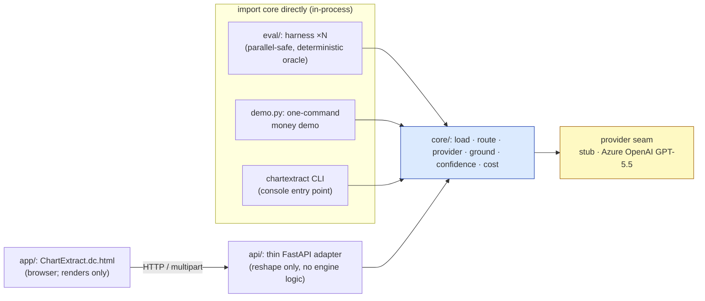
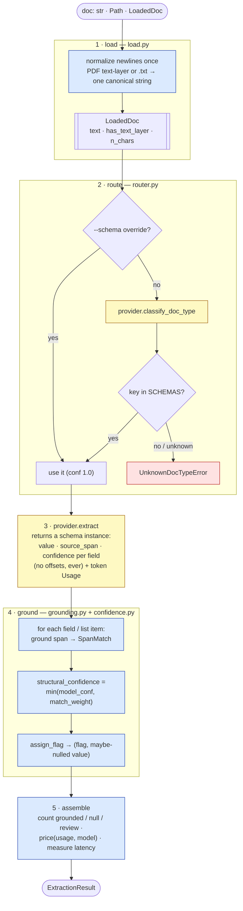
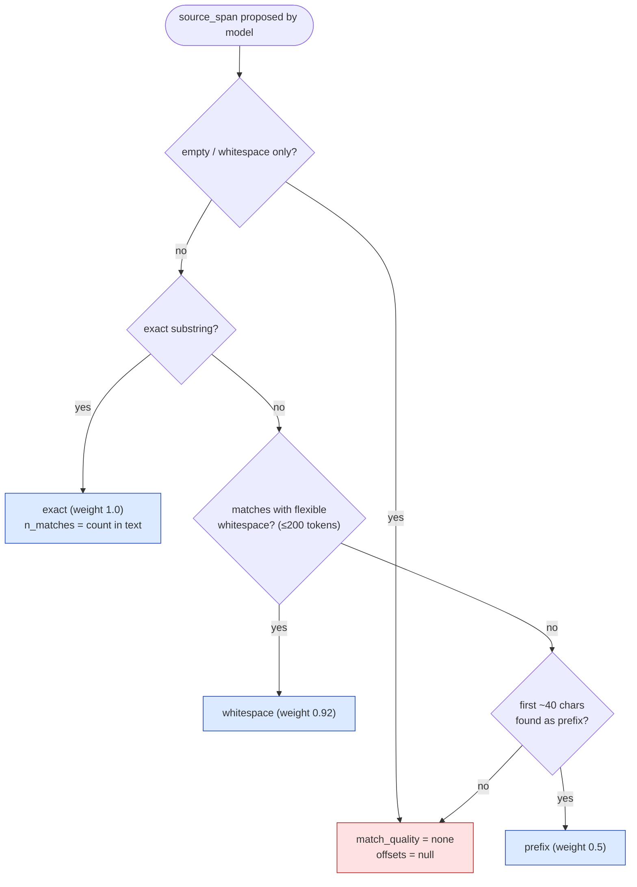
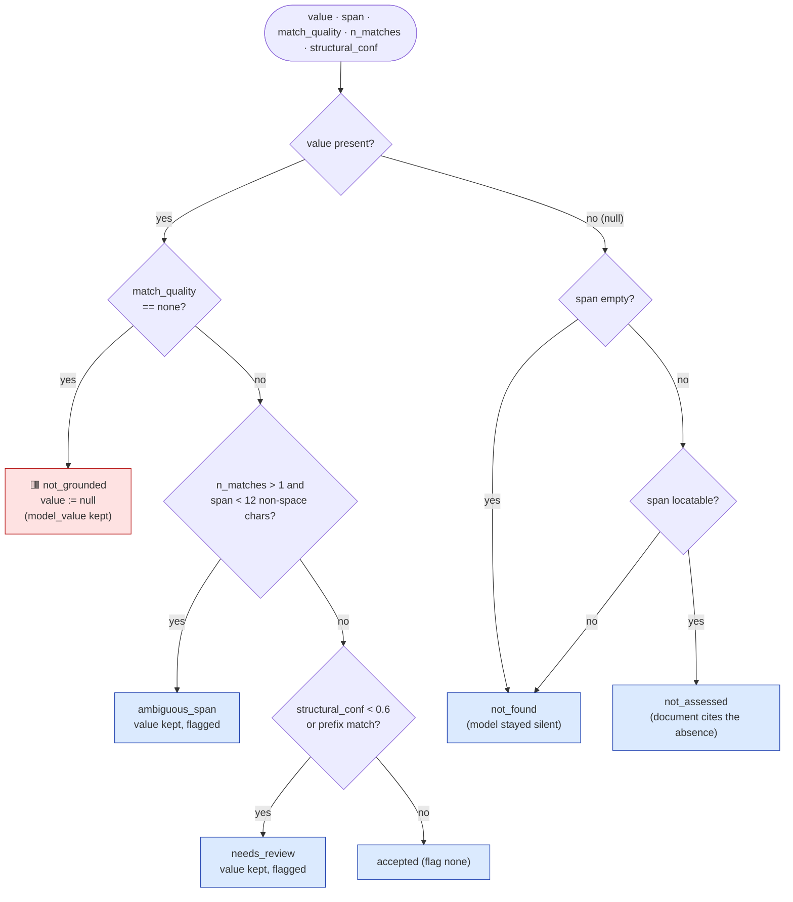
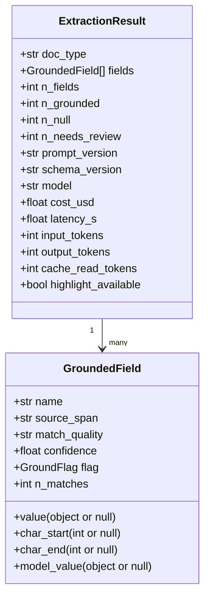
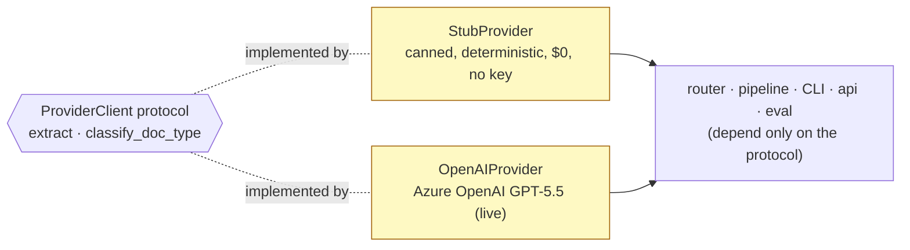
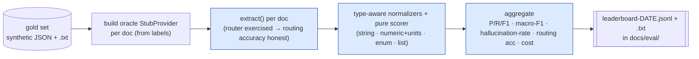
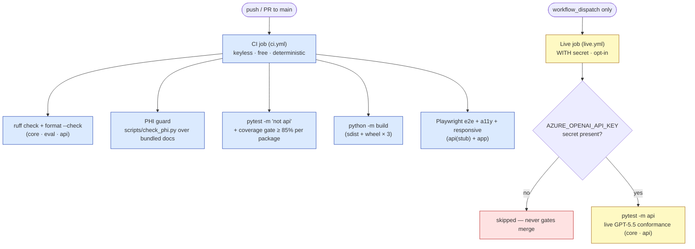

# ChartExtract architecture

This is the long-form companion to the README's architecture section. It covers the in-process
wiring between the four packages, the extraction pipeline stage by stage, the grounding decision
procedure (where hallucination-rate 0 actually comes from), the data contracts, the provider seam,
and the two-tier CI.

Throughout, the colour convention is:

🟦 **deterministic** (plain code; the only thing ever gated) ·
🟨 **LLM** (proposes `{value, source_span, confidence}`, never trusted alone) ·
🟥 **honesty short-circuit** (an ungrounded value is nulled and flagged, never emitted).

The one load-bearing principle: **the model proposes, code disposes.** The model never returns a
character offset, a match quality, a flag, or a price. Every one of those is computed in code
against the canonical source text, so "hallucination-rate 0" is a structural property of the
pipeline, not a hope about the model.

---

## The four packages, and how they wire together

ChartExtract is one engine plus three thin layers around it. **`core/` is a plain importable Python
module. Everything that can import it does — there is no service-to-service HTTP between the Python
components.**



- **`core/`** (`chartextract`) is the engine: the canonical loader, the router, the provider
  protocol, the grounding matcher, the confidence/flag logic, pricing, batch, and the CLI. It is
  provider-agnostic and has no web framework in it.
- **`eval/`**, **`demo.py`**, and the **CLI** call `chartextract.extract()` **in-process**. That is
  what makes eval runs reproducible: each doc gets a fresh deterministic oracle provider, the
  harness runs serially for byte-identical output, and there is no network or shared server to make
  it flaky.
- **`api/`** is a *thin* FastAPI adapter. Its success body for `POST /api/extract` is literally
  `ExtractionResult.model_dump()` — the identical shape the UI's JSON inspector renders. The "no
  extraction/provider logic in `api/`" rule keeps the engine the single source of truth.
- **`app/`** is the one component that can't import a Python module (it runs in the browser), so it
  is the only one that talks over **HTTP** through `api/`, which serves it **same-origin** (no CORS
  in production). All offsets, flags, and confidences are consumed verbatim from the engine; the JS
  never recomputes them.

---

## The extraction pipeline: load → route → extract → ground → assemble

`chartextract.extract(doc, *, schema=None, provider, source_name=None)` in
[`core/src/chartextract/pipeline.py`](../core/src/chartextract/pipeline.py) is the whole engine in
one function. Five stages, only one of which is the LLM.



1. **load** ([`load.py`](../core/src/chartextract/load.py)) normalizes newlines exactly once and
   never mutates the text again. The returned `LoadedDoc.text` is the **single offset source**: both
   what the model sees and what every `char_start`/`char_end` indexes into, so `text[start:end]` is
   always a real substring. A scanned PDF with no text layer returns `has_text_layer=False`, and the
   pipeline honestly drops all offsets to `None` rather than fake them.
2. **route** ([`router.py`](../core/src/chartextract/router.py)) takes the explicit `--schema`
   override (confidence 1.0) or calls the classifier. A type not in `SCHEMAS` raises
   `UnknownDocTypeError` — the engine never silently defaults to a schema.
3. **extract** is the only LLM call on the field path. The provider returns a validated schema
   instance and a token `Usage`; the call is timed for `latency_s`.
4. **ground** locates each proposed span, floors the confidence by match quality, and assigns the
   flag (next section).
5. **assemble** nulls offsets when there is no text layer, counts grounded / null / needs-review,
   prices the usage, and returns the typed `ExtractionResult`.

---

## Grounding: where hallucination-rate 0 comes from

This is the heart of the system. The model hands back `{value, source_span, confidence}`. Two
deterministic functions decide what survives.

### Span matching — `ground()` in `grounding.py`

A whitespace-tolerant matcher tries strategies **in a fixed order** and stops at the first hit,
recording how good the match was:



The result is a `SpanMatch` carrying `match_quality`, `char_start`, `char_end`, and `n_matches`
(only an `exact` match can report `n_matches > 1`).

### Flag assignment — `assign_flag()` in `confidence.py`

Structural confidence is first floored by the match weight:
`structural_conf = min(model_conf, MATCH_WEIGHT[match_quality])`, where
`exact=1.0 · whitespace=0.92 · prefix=0.5 · none=0.0`. A weak match caps the confidence no matter
how sure the model claimed to be. Then the flag is assigned deterministically:



The full flag taxonomy (`GroundFlag`):

| Flag | Meaning | Value |
|---|---|---|
| `accepted` (`None`) | Grounded with adequate confidence | kept |
| `needs_review` | Low structural confidence (< 0.6) or a prefix-only match | kept, flagged |
| `ambiguous_span` | A short span (< 12 non-space chars) that occurs in several places | kept, flagged |
| `not_grounded` | The model invented a value; its span is **not in the document** | **nulled**; proposal kept on `model_value` |
| `not_found` | The document is silent; the model returned `null` with an empty span | null |
| `not_assessed` | The document **explicitly states** the field was not determined — a *cited* absence | null |

`not_grounded` is the structural guarantee: any value whose span can't be located is forced to
`null`, so a hallucinated value can never reach the output. `ambiguous_span` is checked before
`needs_review`; both count toward the UI's "needs review" total.

---

## Data contracts

Both shapes live in [`core/src/chartextract/schemas.py`](../core/src/chartextract/schemas.py) and
are exported from the package root.



What the **model** returns (per field): `value`, `source_span`, `confidence` — and for a `ListField`
(e.g. `medications`, `allergies`), a list of those, flattened by code into `medications[0]`,
`medications[1]`, … rows. What **code** adds: `char_start`/`char_end`, `match_quality`,
the floored `confidence`, the `flag`, `n_matches`, and (only when nulled as `not_grounded`) the
retained `model_value`. The two shipped schemas are `PathologySchema` and `IntakeSchema`, registered
in `SCHEMAS`; both are versioned by `SCHEMA_VERSION`, and prompts by `PROMPT_VERSION`, so a contract
change is a visible, recorded event.

---

## The provider seam

Everything downstream depends only on the `ProviderClient` protocol in
[`provider/base.py`](../core/src/chartextract/provider/base.py): `extract(system, document_text,
schema_model) -> (instance, Usage)` and `classify_doc_type(text) -> (key, confidence, Usage)`. Swap
the backend by changing one constructor.



- **`StubProvider`** ships in the installed package (not in `tests/`) because the API, eval, and demo
  all import it. It replays typed, schema-valid canned instances and records its calls, so the whole
  pipeline runs offline, deterministically, for `$0`.
- **`OpenAIProvider`** is the realized live backend (Azure OpenAI GPT-5.5). It uses strict
  JSON-schema structured output, checks `stop_reason`/`finish_reason` **before** reading content so a
  refusal or truncation surfaces as a typed `RefusalError`/`TruncatedError` (never an index-error
  crash), retries truncation once with doubled headroom, and reports cached prompt tokens for pricing.

Failures are typed and catchable — `MissingAPIKeyError`, `RefusalError`, `TruncatedError`,
`UnknownDocTypeError` — which is exactly what lets `api/` map each to a structured error envelope
instead of a 500.

### Cost, caching, and batch

Pricing is pinned per model in [`cost.py`](../core/src/chartextract/cost.py); an unknown model raises
rather than silently pricing at `$0`. The system prompt + schema are the stable, cacheable prefix
(document text goes in the user turn), and a 50%-cheaper **Batch API** path
([`batch.py`](../core/src/chartextract/batch.py)) re-associates unordered results by `custom_id`. In
the leaderboard, the live model's cost is labeled **measured** (from real usage) while the
Anthropic rows are **estimates** computed from pricing — never shown as measured.

---

## The eval harness

[`eval/`](../eval) imports `core` and scores it against a frozen, **synthetic** gold set
(`eval/gold/`, one JSON label file + one `.txt` per doc). For the default `--provider stub` run it
builds a per-doc **oracle** `StubProvider` from the labels and runs serially, so the JSONL artifact
is byte-identical every time.



It computes per-field precision/recall/F1, macro-F1, the headline **hallucination-rate** (a non-null
value where the gold is null, counted loudly), routing accuracy, and a per-doc cost comparison. With
`--repeats N` the distributional metrics report mean ± spread (run `--provider openai` for a live
GPT-5.5 sweep, optionally `--batch`). The gold set is small and never real PHI — report F1 with wide
intervals; **ChartExtract is not a medical device.**

---

## Two-tier CI

The honesty mechanism in the build: **it is structurally impossible to gate a commit on an LLM
number.** The always-green gate runs entirely on the deterministic stub with no key; the live tests
are a separate, manual, secret-gated workflow that never gates merge.



The `@pytest.mark.api` tests auto-skip without a key, so the free Tier-1 suite is always green. The
PHI tripwire (real SSN/email/phone patterns) keeps every bundled document synthetic. Reproduce the
whole keyless gate locally with `make ci`.

---

## Where things live

```text
core/    the chartextract engine — load · router · provider seam · grounding · confidence · cost · batch · CLI
api/     thin FastAPI adapter over core.extract; serves app/ same-origin (+ Dockerfile)
app/     the browser UI (HTTP to api/), with Playwright e2e / a11y / responsive suites
eval/    field-level eval harness + frozen synthetic gold set + type-aware normalizers
docs/    this file, screenshots, and the dated eval leaderboards (docs/eval/)
```

Related reading: the [README](../README.md) for the quickstart and the money demo, the
[API contract](../api/README.md), the [UI/UX spec](../app/ChartExtract-UIUX-Spec.md), and the
[changelog](../CHANGELOG.md).
